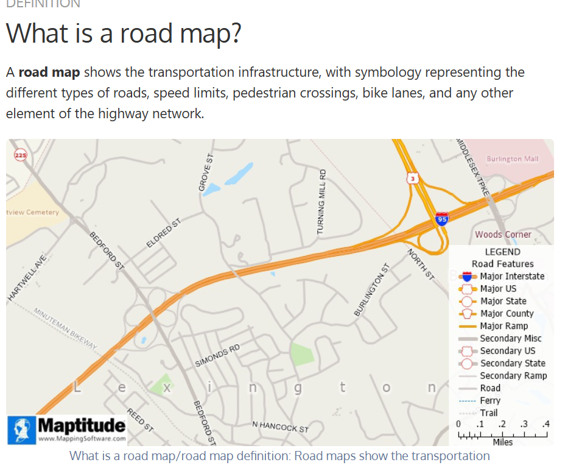

stuff to work on (temp)
- settings file for the project
- unit tests for string matching in [match.ts](services\backend\tests\closestMatch.test.js)
- figure out how to auto generate and clear changelogs and todos i.e todo.md
- github workflows for report.ts (?)

coming ~~not~~ soon

(๑﹏๑)